CUDA Rasterizer
===============

**University of Pennsylvania, CIS 565: GPU Programming and Architecture, Project 4**

* Byumjin Kim
* Tested on: Windows 10, i7-6700HQ @ 2.60GHz 15.89GB (Personal labtop)

### Overview

- Model : Johanna.gltf
- Resolution : 800 x 800
* Physically-based rendering material
* Texture mapping
* Normal mapping
* Environment Map
* Bloom (HDR)

In this project, I have used CUDA to implement a simplified rasterized graphics pipeline, similar to the OpenGL pipeline vertex shading, primitive assembly, rasterization, fragment shading, and a framebuffer for basic features.

### Complete requirements

- Basic Features
	- Vertex shading
	- Primitive assembly
	- Rasterization
	- Fragment shading
	- A depth buffer for storing and depth testing fragments
	- Fragment-to-depth-buffer writing
	- Blinn-Phong shading

- Additional Features
	- Correct color interpolation between points on a primitive
	- Bloom with Using shared memory
	- Backface culling with using stream compaction
	- Blending Stage	
	- UV texture mapping with bilinear texture filtering and perspective correct texture coordinates	
	- Super Sample Anti-Aliasing

- Independent features
	- Physically-based BRDF shading
	- Environment mapping
	- Normal mapping

#### Correct color interpolation between points on a primitive

| Normal Vertex | Corrected Vertex | Comparision |
| ----------- | ----------- | ----------- |
|  | 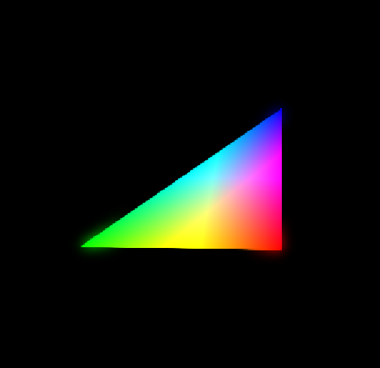 |  |

In graphics API such as DirectX or OpenGL, persepctive correction is adjusted automatically.
But, we need to implement it for this project, manually. I have refered to [scratchapixel's web page](http://www.scratchapixel.com/lessons/3d-basic-rendering/rasterization-practical-implementation/perspective-correct-interpolation-vertex-attributes).

#### Perspective correct texture coordinates & Bilinear texture filtering

| Normal | Corrected | Bilinear | Comparision |
| ----------- | ----------- | ----------- | ----------- |
|  |  | 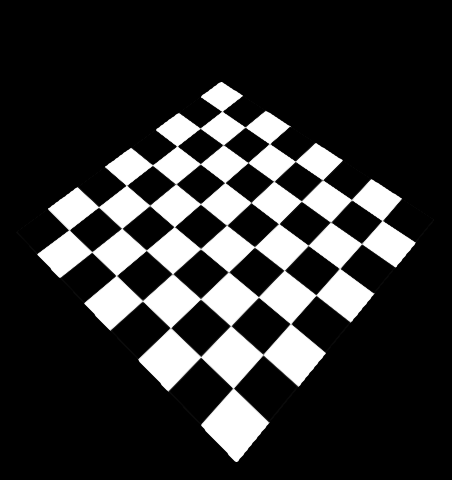 | 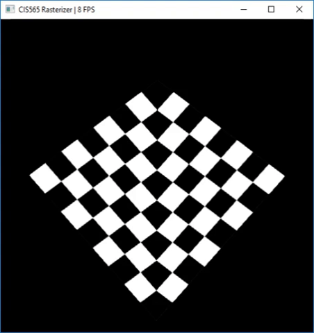 |

When we try to get texture colors along UV coordinates, it will make blocky artifacts because texture's color information is consist of texel beased on integer.
Instead of using this raw integer information, we can interpolate this texel information with float UV coordinates to remove the artifact.

#### Normal(Bump) mapping

| Vertex Normal | Normal mapping | Example |
| ----------- | ----------- | ----------- |
|  |  |  |

#### Backface culling

| Normal | Back Face Culling |
| ----------- | ----------- | 
| 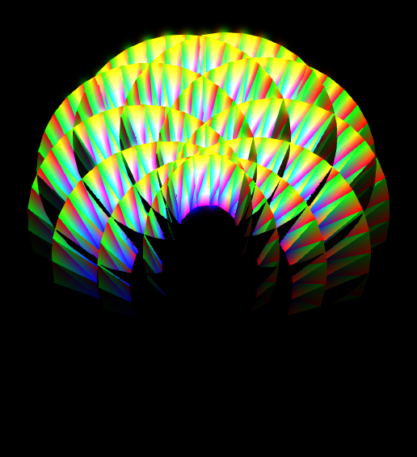 |  |

If we don't need translucent material and use only convex polygons, we don't need to draw back-faces of our objects.
if the result of dot product between view vector and triangle's face normal is minus value, we can assume it is back-face.
Using thrust functions, I could use stream compaction, easily

#### Super Sample Anti-Aliasing

|  x1 Sample | x16 Sample | Comparision |
| ----------- | ----------- | ----------- | 
|  |  | 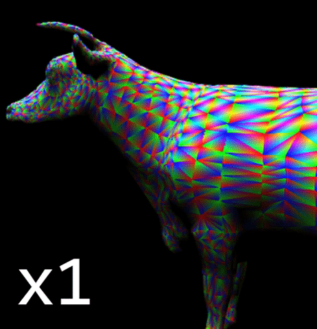 |

I think, Super Sample Anti-Aliasing is the worst efficient AA method. 

#### Physically-based BRDF shading

|  Diffuse |  Roughness | Metallic |
| ----------- | ----------- | ----------- | 
| 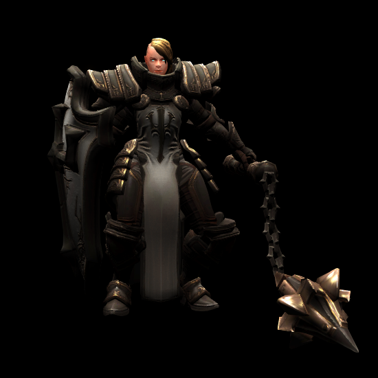 |  | 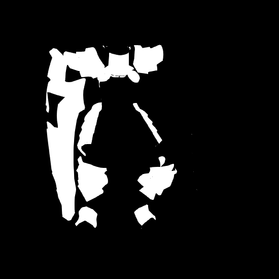  |

I added Physically-based rendering material based on cook-torrence BRDF model.
According to its Roughness value per fragment, it decides its unique surface texture.

|  Environment |  PBS | PBS + Bloom |
| ----------- | ----------- | ----------- | 
| 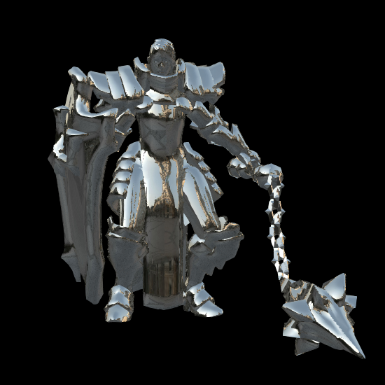 |  | 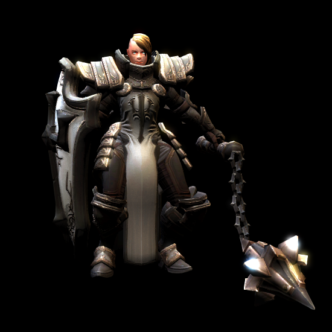  |

And, for this project, I also added Metallic value which indicates the degree how the surface is more like metal.
So, if the metallic value is close to 1.0, it will relfect its environment more.

#### Environment mapping

|  Environment Only |  Reflection on Shield |
| ----------- | ----------- |
|  | 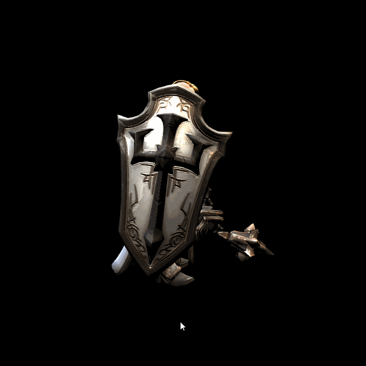 |

If the fragment's metallic is not zero, it takes a color from enviroment map with reflection vector's direction.

#### Bloom & Blending Stage (Post Process)

|  Extract HDR Fragments | Bloom Only | PBS + Bloom |
| ----------- | ----------- | ----------- | 
| 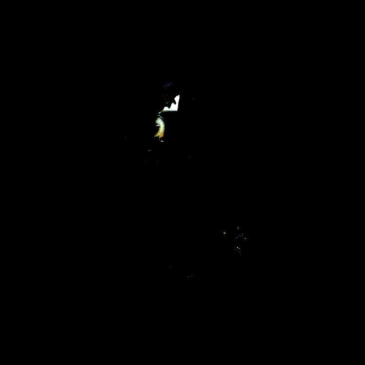 |  |  |

Bloom (sometimes referred to as light bloom or glow) is a computer graphics effect used in video games, demos, and high dynamic range rendering (HDRR) to reproduce an imaging artifact of real-world cameras.
For the first stage, I extracted very bright fragments of the scene. Then, to blur image, I used Gaussian blurring method, which is called two passes (The first pass is for Horizontal Blurring and, the second pass is for Vertical Blurring). Because, for this method, it was easy to use shared memory feature to get its near fragment information per each pixel.
Finally, add fragments of bloom effect to original scene fragment through Blending stage.

### Performance Analysis

#### Perspective correct texture coordinates

|  Vertex Shader | Backface Culling | Rasterize | Fragment Shader |
| ----------- | ----------- | ----------- | ----------- |
| 354 | 1809 | 2598 | 2832 |

#### Perspective correct texture coordinates

|  Off |  On |
| ----------- | ----------- |
| 142 | 140 |

#### Bilinear texture filtering

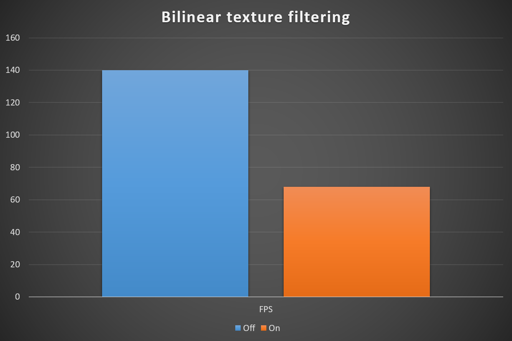

|  Off |  On |
| ----------- | ----------- |
| 140 | 68 |

#### Backface culling

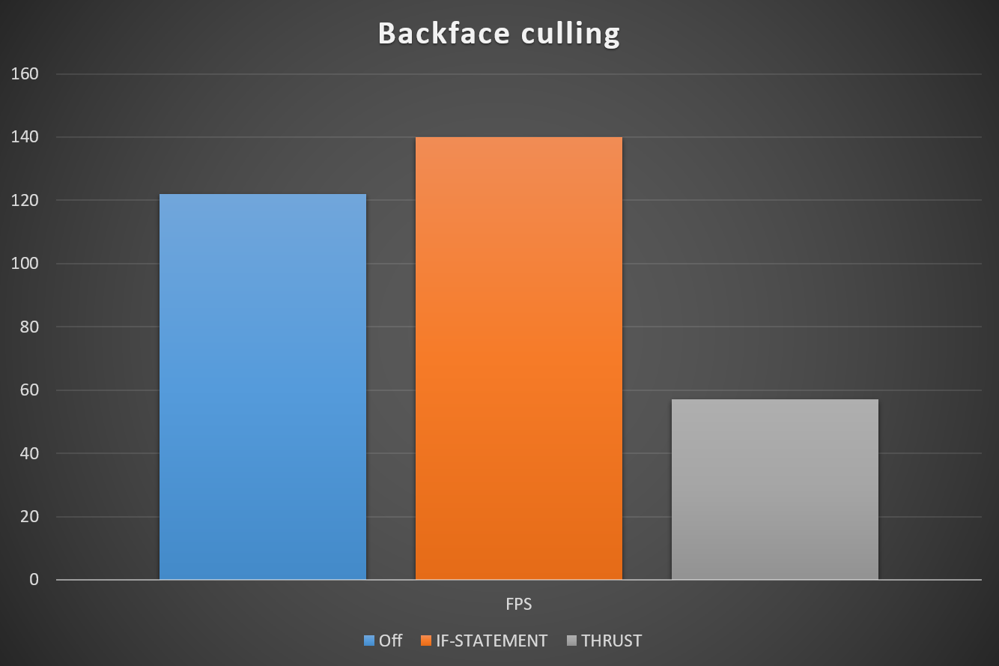

| Off | IF-STATEMENT | THRUST |
| ----------- | ----------- | ----------- |
| 122 | 141 | 57 |

An interesting point is Thrust backfaceCulling makes much slower.

#### Super Sample Anti-Aliasing

| x1 | x4 | x9 | x16 |
| ----------- | ----------- | ----------- | ----------- |
| 141 | 36 | 15 | 9 |

#### Blinn-Phong vs Physically-based BRDF shading

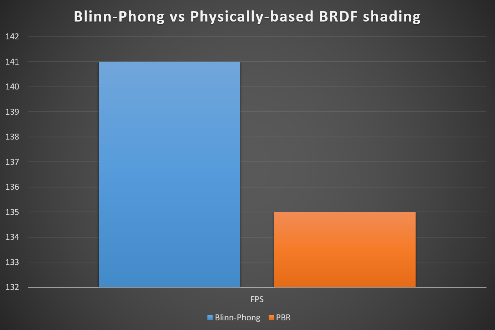

|  Blinn-Phong |  PBS |
| ----------- | ----------- |
| 141 | 135 |

#### Bloom

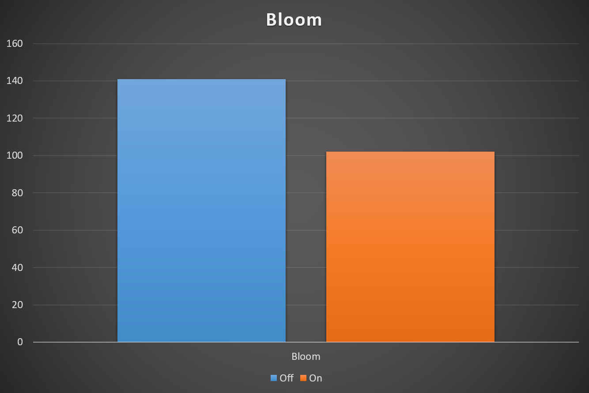

|  Off |  On |
| ----------- | ----------- |
| 141 | 102 |